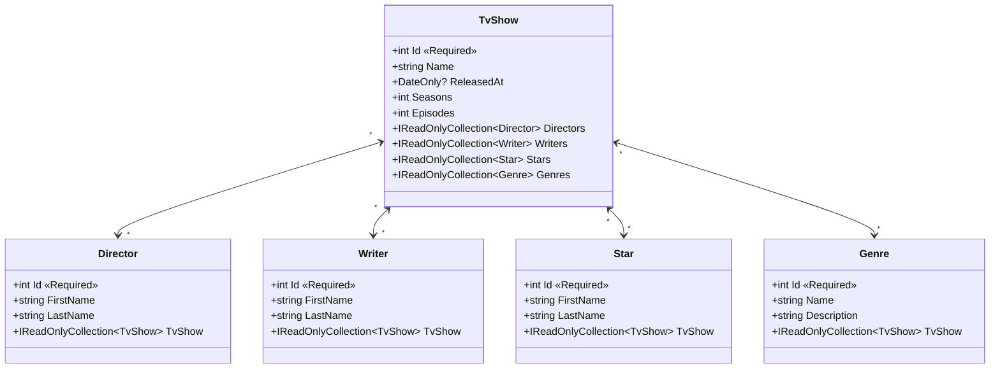
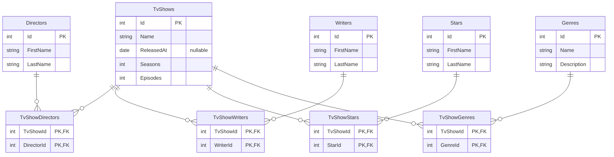
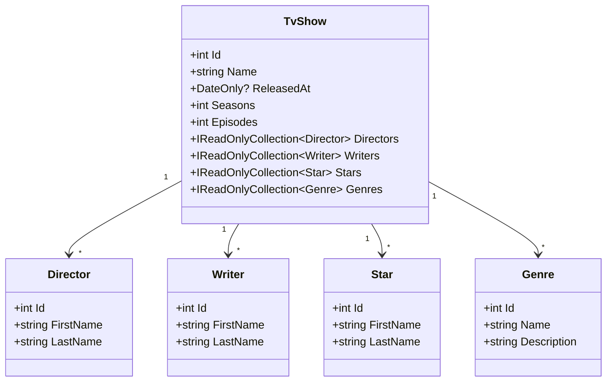
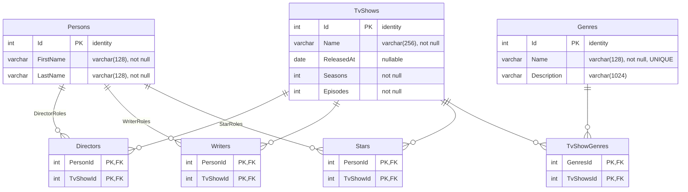

# Schémas — Domaine & MLD (avant / après)

Comparatif des modèles **avant** la refonte hexagonale (dernier commit de **RoronoaZ**, `a9281c5`, 11/06/2026)
et **après** (HEAD de la branche `refactor/fix-hexago`).

Pour chaque état : un **diagramme de classes du domaine** et un **MLD** (les tables SQL que l'infrastructure produit).

> ⚠️ **Au commit de RoronoaZ, l'infrastructure n'avait aucune persistance EF** : le repository était un
> `InMemoryTvShowRepository` (données en dur). **Aucune table SQL réelle n'existait.** Le MLD « avant »
> (section 2) est donc *déduit* du modèle de domaine de l'époque : les navigations bidirectionnelles
> `IReadOnlyCollection<>` des deux côtés correspondent à des relations *many-to-many*, qui auraient
> produit des tables de jointure.

---

## A — Au dernier commit de RoronoaZ (`a9281c5`)

### 1. Diagramme de classes du domaine

Classes **mutables** (`get; set;`), avec `[Required]` sur les `Id` et **navigations bidirectionnelles**
(collection des deux côtés) → 4 relations *many-to-many*.

### 2. MLD que l'infra aurait donné (déduit du domaine — aucune table réelle à ce commit)

Les 4 relations *many-to-many* impliquent 5 tables d'entités + 4 tables de jointure.

---

## B — Au dernier commit de la branche (`refactor/fix-hexago`, HEAD)

### 3. Diagramme de classes du domaine

Classes **`sealed` immuables** (constructeurs primaires, `get` seul), **sans annotation EF** et
**navigations unidirectionnelles** : seul `TvShow` connaît ses collaborateurs (pas de back-référence).

### 4. MLD réel des entités de l'infra (entités EF `ProjectZero.Database` + migration `InitialCreate`)

Changement structurel majeur : **`Person` est factorisée** dans une table unique, et
`Director`/`Writer`/`Star` deviennent des **tables de rôle** (jointures `Person`↔`TvShow` à clé composite).
Seul `Genre` reste une entité à part entière reliée par une table de jointure pure (`TvShowGenres`).

---

## Ce qui a changé entre les deux

| Aspect | RoronoaZ (`a9281c5`) | HEAD (`refactor/fix-hexago`) |
|---|---|---|
| **Domaine** | Classes mutables, `[Required]`, nav. **bidirectionnelles** | `sealed` immuables, ctor primaire, nav. **unidirectionnelles** depuis `TvShow` |
| **Couplage EF** | `DataAnnotations` dans le domaine | Domaine pur ; config EF déportée dans `*Entity` |
| **Persistance** | `InMemoryTvShowRepository` (données en dur, **aucune table**) | EF Core / PostgreSQL, entités `internal sealed` dans `ProjectZero.Database` |
| **Personnes** | 3 tables distinctes `Directors`/`Writers`/`Stars` (chacune avec `FirstName`/`LastName`) | 1 table `Persons` factorisée + 3 tables de **rôle** (jointure à clé composite) |
| **Genre** | Table d'entité + jointure | Idem (`Genres` + `TvShowGenres`), avec `Name` **UNIQUE** et longueurs contraintes |
| **Contraintes SQL** | Aucune (déduites) | `varchar(n)`, `NOT NULL`, index unique, FK `ON DELETE CASCADE`, seed `Breaking Bad` / `The Last of Us` |

> Sources : domaine `ProjectZero.TvShows.Domain/*.cs`, entités EF `ProjectZero.Database/Entities/*.cs`,
> migration `ProjectZero.Database/Migrations/20260614150145_InitialCreate.cs`.
